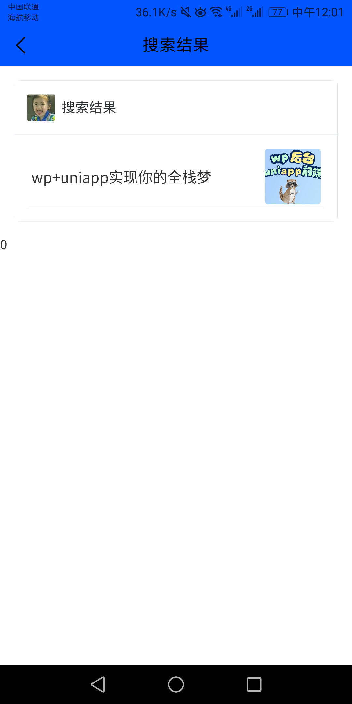

## 项目说明
使用uniapp开发的一个博客APP系统，ui库使用uview，博客文章api接口使用rest api，APP首页轮播图及音乐播放列表使用php编写的简单api。
因为我也是刚开始入手uniapp，所以项目难免有些地方写的不完善，适合新手当做练手的项目，如果你有wordpress站点，也可以零成本使用本项目按照下面的步骤生成一个APP。后期可能会结合rest api开发自定义字段，完成APP商城，个人界面相关的功能。
## APP截图  
  

## 使用说明
1，首先确保你的wordpress站点rest api可用，你可以访问 <youdomain>/wp-json/wp/v2/posts 。如果返回json数据则正常。反之，请检查是否关闭“rest api身份认证”，”rest api禁用“等插件。

2，将项目中的api文件夹复制到你的wordpress站点主目录。修改轮播图和音乐列表即修改php文件夹相应的内容。

3，修改页面中的请求地址，将uniapp所有vue页面的“你的域名”改为你的域名，并将请求轮播图和请求音乐列表的地址修改为你的。

4，此时你已拥有一个基于wordpress站点的APP。如果遇到任何问题，欢迎咨询。

** 如果这个项目对你有用，欢迎打赏，么么哒 **  

